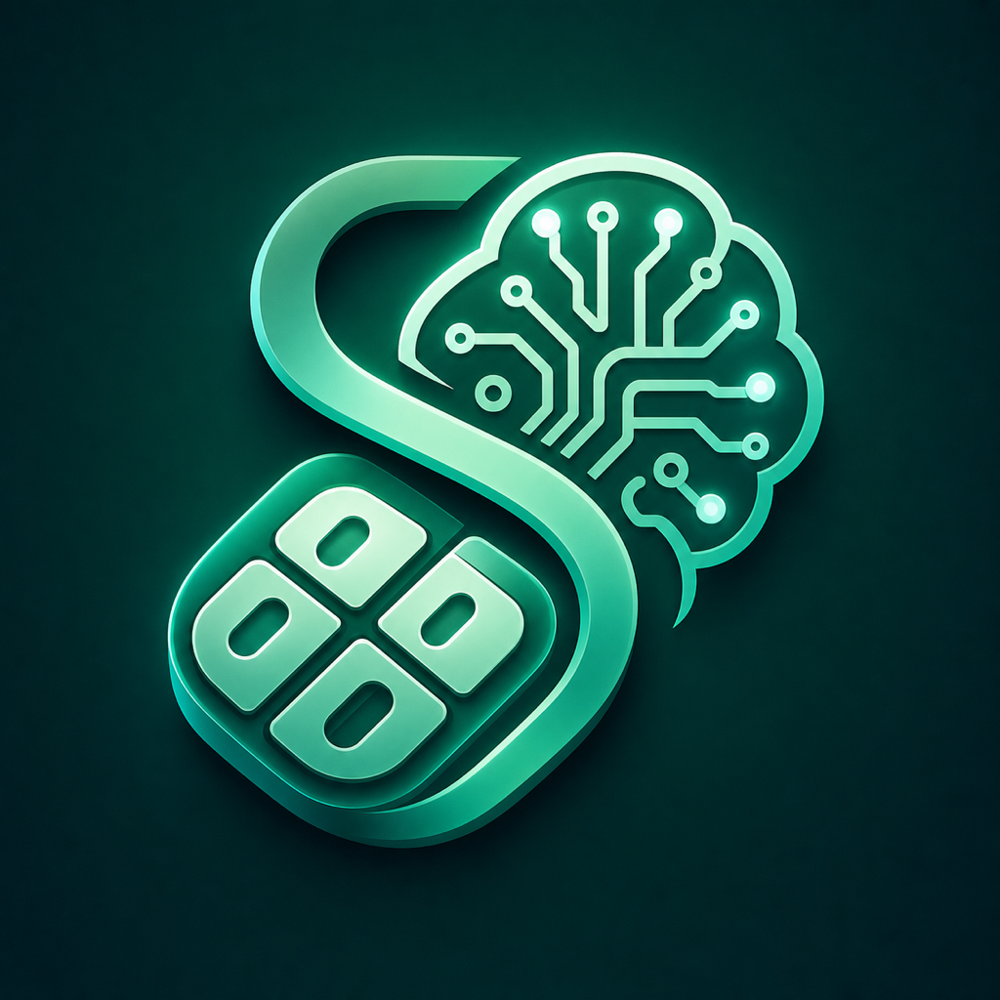
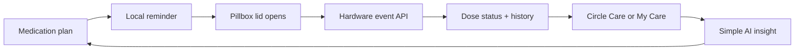
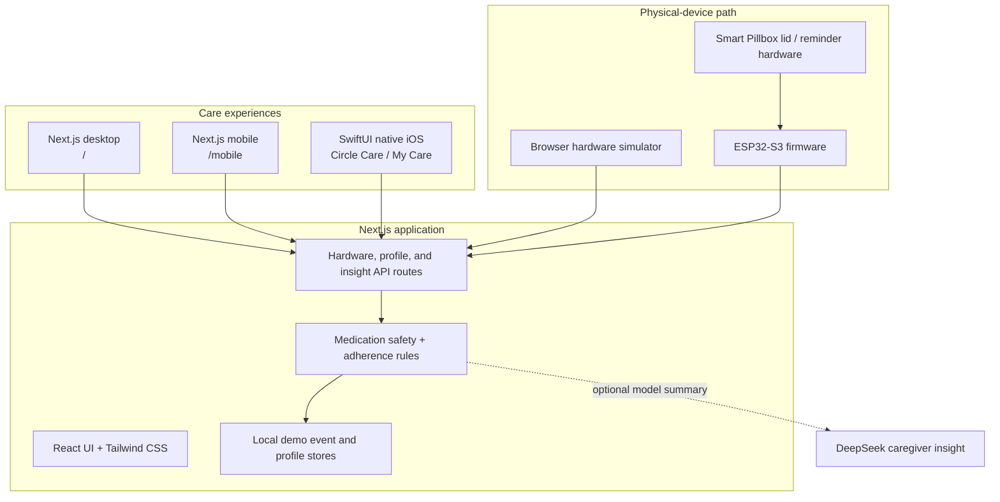

<div align="center">
  
  <h1>Smart Pillbox AI</h1>
  <p><strong>Medication care that feels calm, clear, and connected</strong></p>
  <p>See today's doses · Support someone you love · Manage your own routine · Learn from real pillbox events</p>
  <p>
    <a href="README.md"><strong>English</strong></a>
    ·
    <a href="README.zh-Hant.md">繁體中文</a>
  </p>
  <p>
    <a href="https://github.com/stephenovo/smart-pillbox-ai"><strong>GitHub</strong></a>
    ·
    <a href="ios/Careloop/README.md">Native iOS guide</a>
    ·
    <a href="docs/HARDWARE_MVP_SETUP.md">Hardware setup</a>
  </p>
  <p>
    
    
    
    
    
  </p>
</div>

<p align="center">
  
</p>

## Overview

Smart Pillbox AI is an end-to-end medication adherence system for people who
take daily medicines and the family members who support them. A Next.js care
dashboard, a phone-first web view, a native SwiftUI iPhone app, and an ESP32
hardware path all share the same medication and pillbox event API.

The product is intentionally built around two warm, practical experiences:

| Experience | Designed for | What it keeps in focus |
| --- | --- | --- |
| **Circle Care** | Family members and caregivers | Multiple people, medication activity, AI observations, care journal, and clinic handoff context |
| **My Care** | Someone managing their own medicines | Larger type, fewer controls, today's progress, the next dose, and one simple AI check-in |

> **The loop in one sentence:** configure a routine, receive a reminder, record
> a real pillbox opening, turn the event into a clear status, and surface only
> the next useful action.

## Product loop



## What is implemented

| Area | Capabilities |
| --- | --- |
| **Two care experiences** | Persistent `Circle Care` and `My Care` mode switching in the web app and native iOS app |
| **Circle Care** | Care circle selection, medication setup, adherence overview, device feed, care messages, profile sync, and detailed insights |
| **My Care** | Larger self-management layout, My Day, My Medicines, AI Check-in, simplified Settings, and no caregiver-only actions |
| **Medication safety** | On-time, late, early, missed, duplicate-opening, wrong-compartment, due-soon, and waiting-for-device states |
| **AI insight** | Rule-based activity analysis plus server-side DeepSeek V4 Flash observations with explicit non-medical-advice boundaries |
| **Hardware bridge** | ESP32-S3 starter firmware, reminder state, lid-event upload, device heartbeat, and the browser hardware simulator |
| **Profile and persistence** | `/api/profile`, local profile recovery, medication plan storage, hardware event storage, and native UserDefaults persistence |
| **Native iOS** | SwiftUI app for iOS 17+, TestFlight distribution, live DeepSeek AI Insights, new-pillbox guidebooks, pillbox removal, deliberate mode switching, 12 original family portraits, local photo avatars, and Build 10 testing |
| **Safety boundary** | The system records compartment or lid openings; it does not claim that a person swallowed a medicine or replace clinical advice |

## Screens and experiences

### Native iOS: Circle Care and My Care

The native app keeps one four-tab structure and changes the language and
complexity with the selected experience:

```text
Circle Care                  My Care
Today                        My Day
Meds                         My Medicines
Caregiver AI                 AI Check-in
Settings                     Settings
```

`My Care` is not a reduced medical judgment system. It is a calmer way to see
the same medication plan and real device events without caregiver workflow
overhead.

### Caregiver web dashboard

The desktop web app is optimized for scanning and follow-up:

- medication initialization and buffer-time setup
- dashboard adherence matrix and event log
- device activity and reminder controls
- care messages and profile settings
- full medication risk and clinic-visit insight reports

### Phone-first web view

The `/mobile` route provides a compact caregiver experience with today's
overview, slot control, event polling, an event timeline, and AI insight.

<details>
  <summary><strong>View product imagery</strong></summary>
  <br />
  <p align="center">
    
    
  </p>
</details>

## Architecture



### Design principles

1. **Real events over reassuring fiction.** The dashboard does not invent a
   successful opening event when the device is offline.
2. **Rules before language models.** Dose classification, safety states, and
   caregiver-defined buffers stay deterministic and inspectable.
3. **One source of truth.** Web, mobile, native iOS, and hardware demos use the
   same `/api/hardware/*` contracts.
4. **Different people need different density.** Circle Care supports follow-up;
   My Care keeps the next meaningful piece of information obvious.
5. **No clinical overreach.** AI summaries are plain-language support, not a
   dosage change, diagnosis, or replacement for a clinician.

## Repository layout

```text
smart-pillbox-ai-web/
├── app/                         # Next.js App Router pages and API routes
│   ├── page.tsx                 # Desktop Circle Care / My Care experience
│   ├── mobile/                  # Phone-first caregiver view
│   ├── hardware-simulator/     # Browser-based device event simulator
│   └── api/                     # Hardware, profile, and insight endpoints
├── src/
│   ├── components/              # Product panels and shared UI
│   ├── lib/                     # Safety rules, AI engine, sample data, stores
│   └── types/                   # Hardware, medication, and profile contracts
├── ios/Careloop/                # Native SwiftUI iOS 17+ app
├── hardware/esp32-s3/           # ESP32-S3 starter firmware and wiring notes
├── docs/                        # Hardware MVP setup and checklists
├── public/landing/              # Product imagery used by the landing page
├── package.json                 # Web scripts and dependencies
└── README.md                    # This guide
```

## Quick start

### 1. Web app

Requirements: Node.js 20+, npm, and a modern browser.

```bash
git clone https://github.com/stephenovo/smart-pillbox-ai.git
cd smart-pillbox-ai
npm install
npm run dev
```

Open the main experience at [http://localhost:3000](http://localhost:3000).

| Route | Purpose |
| --- | --- |
| `/` | Desktop care dashboard with Circle Care and My Care |
| `/mobile` | Phone-first caregiver view |
| `/hardware-simulator` | Simulated pillbox reminders and lid openings |
| `/studio` | Physical-device operations, telemetry, commands, and event provenance |
| `/landing` | Product and brand presentation |

### 2. Native iOS app

Requirements: macOS, Xcode 16+, and iOS 17+.

```bash
open ios/Careloop/Careloop.xcodeproj
```

Select the `Careloop` scheme and an iPhone simulator. For live hardware data,
run the web server on port `3100`:

```bash
env -u NODE_OPTIONS npm run dev -- --hostname 127.0.0.1 --port 3100
```

The native app defaults to the production API at `https://smartpb.me` and
device ID `PILLBOX-DEMO-001`. Build 10 automatically migrates the legacy
`127.0.0.1:3100` default to the production endpoint. Both values remain
editable in native Settings for local hardware development.

Build from the command line:

```bash
DEVELOPER_DIR=/Applications/Xcode.app/Contents/Developer \
  xcodebuild \
  -project ios/Careloop/Careloop.xcodeproj \
  -scheme Careloop \
  -sdk iphonesimulator \
  -configuration Debug \
  CODE_SIGNING_ALLOWED=NO \
  build
```

### 3. ESP32-S3 hardware path

The current physical MVP runs a verified two-slot loop before expansion to the
full eight-slot prototype:

```text
docs/HARDWARE_MVP_SETUP.md
hardware/esp32-s3/smart_pillbox_demo/smart_pillbox_demo.ino
```

The firmware sends real lid events to:

```text
GET    /api/hardware/plan
POST   /api/hardware/events
GET    /api/hardware/events
GET    /api/hardware/state?deviceId=PILLBOX-DEMO-001
POST   /api/hardware/state
POST   /api/hardware/telemetry
```

The demo persists local hardware events under `.data/`; that file is ignored
and is not a production database.

## Configuration and safety

- Copy environment examples locally when they are present; never commit live
  API keys, passwords, device credentials, or provisioning secrets.
- `DEEPSEEK_API_KEY` is a server-only secret and must never be exposed through
  `NEXT_PUBLIC_*` or embedded in the iOS app. The deployed route currently uses
  `DEEPSEEK_MODEL=deepseek-v4-flash`.
- The core activity report remains deterministic. DeepSeek only turns that
  structured report into a short observation and never chooses medication,
  dosage, schedules, or medical advice.
- The hardware MVP detects lid or compartment openings, not ingestion.
- Medication names, schedules, dosage decisions, and high-risk classifications
  should be confirmed with a healthcare professional.
- Native profile edits save on the iPhone first and retry server sync after an
  offline edit.

## Verification

```bash
# Web lint and production build
npm run lint
npm run build

# Native simulator build
DEVELOPER_DIR=/Applications/Xcode.app/Contents/Developer \
  xcodebuild -project ios/Careloop/Careloop.xcodeproj \
  -scheme Careloop -sdk iphonesimulator -configuration Debug \
  CODE_SIGNING_ALLOWED=NO build
```

The current native release line is `1.0 (9)`, distributed through TestFlight
to the internal testing group.

## Documentation

- [Native iOS development and TestFlight](ios/Careloop/README.md)
- [Hardware MVP setup from zero](docs/HARDWARE_MVP_SETUP.md)
- [Hardware API and parts guide](docs/hardware/README.md)
- [Hardware MVP checklist](docs/hardware/MVP_CHECKLIST.md)
- [ESP32-S3 firmware README](hardware/esp32-s3/smart_pillbox_demo/README.md)

## Roadmap

- [x] Circle Care and My Care experiences across web and native iOS
- [x] Hardware event API and browser simulator
- [x] ESP32-S3 firmware and verified two-slot hardware MVP path
- [x] Deterministic medication safety states and caregiver insight reports
- [x] Profile sync with local offline recovery
- [x] Native iOS TestFlight Build 10 with live DeepSeek AI Insights
- [ ] Expand hardware from the MVP loop to a production-ready enclosure
- [ ] Collect real-device adherence history for model calibration
- [ ] Add production authentication, database persistence, and observability
- [ ] Complete App Store release workflow and accessibility audit

---

<div align="center">
  <strong>Keep the important medicine moments visible, without making care feel complicated.</strong>
</div>
