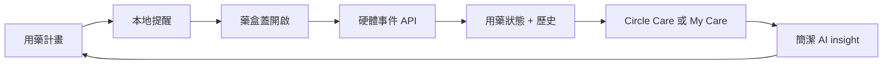
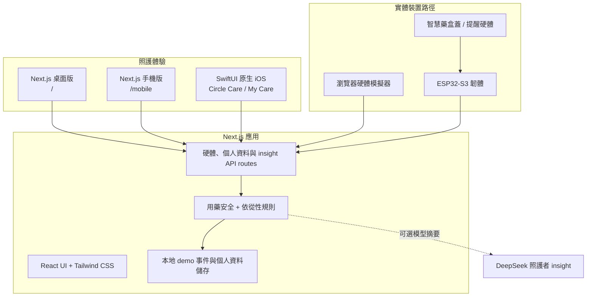

<div align="center">
  
  <h1>Smart Pillbox AI</h1>
  <p><strong>讓用藥照護變得安定、清楚，也更有連結感</strong></p>
  <p>查看今日用藥 · 支援你愛的人 · 管理自己的日常 · 從真實藥盒事件中理解照護狀態</p>
  <p>
    <a href="README.md">English</a>
    ·
    <a href="README.zh-Hant.md"><strong>繁體中文</strong></a>
  </p>
  <p>
    <a href="https://github.com/stephenovo/smart-pillbox-ai"><strong>GitHub</strong></a>
    ·
    <a href="ios/Careloop/README.md">原生 iOS 指南</a>
    ·
    <a href="docs/HARDWARE_MVP_SETUP.md">硬體設定</a>
  </p>
  <p>
    
    
    
    
    
  </p>
</div>

<p align="center">
  
</p>

## 專案概覽

Smart Pillbox AI 是一套端到端的用藥依從性照護系統，服務每天需要服藥的人，也服務陪伴與支援他們的家人。Next.js 照護儀表板、手機優先的 Web 介面、SwiftUI 原生 iPhone App，以及 ESP32 硬體路徑，都共用同一套用藥與藥盒事件 API。

這個產品刻意設計成兩種溫暖、實用的體驗：

| 體驗 | 適合對象 | 關注重點 |
| --- | --- | --- |
| **Circle Care** | 家人與照護者 | 多位被照護者、用藥風險、裝置活動、照護備註，以及下一步跟進 |
| **My Care** | 自己管理用藥的人 | 更大的字體、更少的操作、今日進度、下一次用藥，以及一個簡單的 AI 提醒 |

> **一句話的產品閉環：**設定用藥日常，收到提醒，記錄真實藥盒開啟事件，把事件轉換成清楚的狀態，最後只呈現下一個真正有用的行動。

## 產品流程



## 目前已實作

| 區域 | 功能 |
| --- | --- |
| **雙照護體驗** | Web App 與原生 iOS App 皆支援持久化的 `Circle Care` / `My Care` 模式切換 |
| **Circle Care** | 照護圈選擇、用藥設定、依從性總覽、裝置事件流、照護訊息、個人資料同步，以及詳細 insight |
| **My Care** | 更適合自我管理的大字體版面、My Day、My Medicines、AI Check-in、簡化版 Settings，並移除照護者專用操作 |
| **用藥安全狀態** | 準時、延遲、過早、漏服、重複開啟、錯誤藥格、即將到期，以及等待裝置事件 |
| **AI insight** | 以規則為基礎的依從性分析，並可選用 DeepSeek 產生照護者摘要與門診備註 |
| **硬體橋接** | ESP32-S3 入門韌體、提醒狀態、藥盒蓋事件上傳、裝置心跳，以及瀏覽器硬體模擬器 |
| **個人資料與持久化** | `/api/profile`、本地個人資料恢復、用藥計畫儲存、硬體事件儲存，以及原生 UserDefaults 持久化 |
| **原生 iOS** | 支援 iOS 17+ 的 SwiftUI App、TestFlight 發佈、新藥盒 Guidebook、Caregiver AI、確認式模式切換，以及 Build 7 測試 |
| **安全邊界** | 系統記錄藥格或藥盒蓋開啟事件；不宣稱使用者已吞服藥物，也不取代醫療建議 |

## 介面與體驗

### 原生 iOS：Circle Care 與 My Care

原生 App 保留同一套四分頁結構，並依照選擇的體驗改變語氣與資訊密度：

```text
Circle Care                  My Care
Today                        My Day
Meds                         My Medicines
Caregiver AI                 AI Check-in
Settings                     Settings
```

`My Care` 不是降低醫療判斷標準的版本，而是用更平靜的方式呈現同一份用藥計畫與真實裝置事件，讓自己照顧自己的人不用被照護者工作流打擾。

### 照護者 Web 儀表板

桌面 Web App 適合快速掃描狀態並採取跟進行動：

- 初始化用藥與設定緩衝時間
- 儀表板依從性矩陣與事件紀錄
- 裝置活動與提醒控制
- 照護訊息與個人資料設定
- 完整的用藥風險與門診 insight 報告

### 手機優先 Web 介面

`/mobile` 路由提供精簡的照護者體驗，包含今日總覽、藥格控制、事件輪詢、事件時間線，以及 AI insight。

<details>
  <summary><strong>查看產品圖片</strong></summary>
  <br />
  <p align="center">
    
    
  </p>
</details>

## 系統架構



### 設計原則

1. **真實事件優先於安慰式假象。**裝置離線時，儀表板不會憑空建立「成功開啟」事件。
2. **規則先於語言模型。**用藥分類、安全狀態，以及照護者定義的緩衝時間，都保持可檢查、可解釋。
3. **單一事實來源。**Web、手機版、原生 iOS 與硬體 demo 使用同一套 `/api/hardware/*` 合約。
4. **不同的人需要不同的資訊密度。**Circle Care 支援跟進；My Care 讓下一個重要資訊保持明顯。
5. **不跨越臨床邊界。**AI 摘要是白話支援，不是劑量調整、診斷，也不能取代臨床醫師。

## Repository 結構

```text
smart-pillbox-ai-web/
├── app/                         # Next.js App Router 頁面與 API routes
│   ├── page.tsx                 # 桌面 Circle Care / My Care 體驗
│   ├── mobile/                  # 手機優先的照護者介面
│   ├── hardware-simulator/      # 瀏覽器裝置事件模擬器
│   └── api/                     # 硬體、個人資料與 insight endpoints
├── src/
│   ├── components/              # 產品面板與共用 UI
│   ├── lib/                     # 安全規則、AI engine、範例資料與 stores
│   └── types/                   # 硬體、用藥與個人資料 contracts
├── ios/Careloop/                # 原生 SwiftUI iOS 17+ App
├── hardware/esp32-s3/           # ESP32-S3 入門韌體與接線說明
├── docs/                        # 硬體 MVP 設定與檢查清單
├── public/landing/              # Landing page 使用的產品圖片
├── package.json                 # Web scripts 與 dependencies
└── README.md                    # 英文指南
```

## 快速開始

### 1. Web App

需求：Node.js 20+、npm，以及現代瀏覽器。

```bash
git clone https://github.com/stephenovo/smart-pillbox-ai.git
cd smart-pillbox-ai
npm install
npm run dev
```

在 [http://localhost:3000](http://localhost:3000) 開啟主要體驗。

| 路由 | 用途 |
| --- | --- |
| `/` | 支援 Circle Care 與 My Care 的桌面照護儀表板 |
| `/mobile` | 手機優先的照護者介面 |
| `/hardware-simulator` | 模擬藥盒提醒與藥盒蓋開啟事件 |
| `/landing` | 產品與品牌展示 |

### 2. 原生 iOS App

需求：macOS、Xcode 16+，以及 iOS 17+。

```bash
open ios/Careloop/Careloop.xcodeproj
```

選擇 `Careloop` scheme 與 iPhone simulator。若要讀取即時硬體資料，請在 port `3100` 執行 Web server：

```bash
env -u NODE_OPTIONS npm run dev -- --hostname 127.0.0.1 --port 3100
```

原生 App 預設使用 `http://127.0.0.1:3100` 與裝置 ID `PILLBOX-DEMO-001`。實體 iPhone 需要使用 Mac 的 LAN address 或 production HTTPS endpoint；兩者都可以在原生 Settings 裡修改。

從 command line 建置：

```bash
DEVELOPER_DIR=/Applications/Xcode.app/Contents/Developer \
  xcodebuild \
  -project ios/Careloop/Careloop.xcodeproj \
  -scheme Careloop \
  -sdk iphonesimulator \
  -configuration Debug \
  CODE_SIGNING_ALLOWED=NO \
  build
```

### 3. ESP32-S3 硬體路徑

在接上完整八格原型之前，先從單格流程開始：

```text
docs/HARDWARE_MVP_SETUP.md
hardware/esp32-s3/smart_pillbox_demo/smart_pillbox_demo.ino
```

韌體會把真實藥盒蓋事件送到：

```text
GET    /api/hardware/plan
POST   /api/hardware/events
GET    /api/hardware/events
GET    /api/hardware/state?deviceId=PILLBOX-DEMO-001
POST   /api/hardware/state
```

Demo 會把本地硬體事件存在 `.data/`；該檔案已被忽略，並不是 production database。

## 設定與安全

- 若專案中有環境變數範例，請複製到本地使用；不要提交真實 API key、密碼、裝置憑證或 provisioning secrets。
- DeepSeek route 是可選的。模型服務不可用時，核心 App 仍會使用 deterministic local insight text 正常運作。
- 硬體 MVP 偵測的是藥盒蓋或藥格開啟，不是吞服行為。
- 藥名、時程、劑量決策，以及高風險分類，都應由醫療專業人員確認。
- 原生個人資料編輯會先儲存在 iPhone 上，離線修改後會重新嘗試同步到 server。

## 驗證

```bash
# Web lint 與 production build
npm run lint
npm run build

# Native simulator build
DEVELOPER_DIR=/Applications/Xcode.app/Contents/Developer \
  xcodebuild -project ios/Careloop/Careloop.xcodeproj \
  -scheme Careloop -sdk iphonesimulator -configuration Debug \
  CODE_SIGNING_ALLOWED=NO build
```

目前原生 release line 是 `1.0 (7)`，透過 TestFlight 發佈給 internal testing group。

## 文件

- [原生 iOS 開發與 TestFlight](ios/Careloop/README.md)
- [從零開始設定 Hardware MVP](docs/HARDWARE_MVP_SETUP.md)
- [Hardware API 與零件指南](docs/hardware/README.md)
- [Hardware MVP 檢查清單](docs/hardware/MVP_CHECKLIST.md)
- [ESP32-S3 韌體 README](hardware/esp32-s3/smart_pillbox_demo/README.md)

## Roadmap

- [x] Web 與原生 iOS 的 Circle Care / My Care 雙體驗
- [x] 硬體事件 API 與瀏覽器模擬器
- [x] ESP32-S3 入門韌體與單格 MVP 路徑
- [x] Deterministic medication safety states 與照護者 insight reports
- [x] Profile sync 與本地離線恢復
- [x] 原生 iOS TestFlight Build 7
- [ ] 將硬體從 MVP 流程擴展成 production-ready enclosure
- [ ] 收集真實裝置依從性歷史，用於模型校準
- [ ] 加入 production authentication、database persistence 與 observability
- [ ] 完成 App Store release workflow 與 accessibility audit

---

<div align="center">
  <strong>讓重要的用藥時刻被看見，也不讓照護變得複雜。</strong>
</div>
